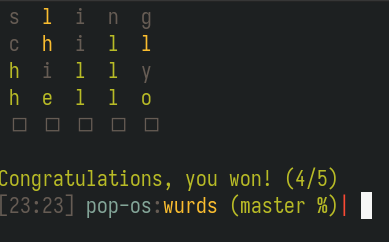

## wurds_tui

wurds_tui is an interactive text-based game similar to [Wordle](https://www.powerlanguage.co.uk/wordle/).

### Running

The application may be run without any arguments to provide the default experience. In this case, it uses the bundled dictionary.

You may also specify flags (in any combination) to modify this behavior.
| flag | effect |
| ---- | ------ |
| `--dictionary` / `-d` | Specify a dictionary file to use instead of the bundled dictionary |
| `--free-input` / `-i` | If set, input words do not need to be recognized by the dictionary |
| `--forced-word` / `-w` | Force the game to use a specific word as the puzzle |

Specify `--help`/`-h` to see help text.

#### Notes

- Custom dictionaries (specified by `-d`) are plain-text files, with one word on each line. Words that are not five characters long are discarded.
- If `-i` is not set, user guesses must be present in the dictionary. If not present in the dictionary, it does not count towards a guess.
- When using `-w` to force a puzzle word, that word is automatically added to the dictionay (bundled or custom).

#### Screenshots

